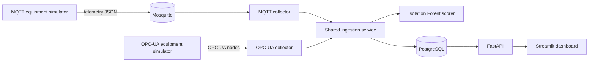

# Industrial IoT Monitoring and Predictive Analytics Platform

[](https://github.com/harshags98work-png/industrial-iot-predictive-platform/actions/workflows/ci.yml)
[](https://www.python.org/)
[](LICENSE)

I started this project to understand the complete path from industrial equipment telemetry to something an engineer can inspect and act on. The system simulates rotating equipment, collects readings through MQTT and OPC-UA, stores them in PostgreSQL, scores unusual operating patterns, and presents the results through an API and dashboard.

Everything runs locally with Docker Compose. The equipment data and fault conditions are synthetic, so the anomaly output should be treated as an engineering experiment—not a validated prediction of real equipment failure.

## What is implemented

- MQTT simulation and collection for a centrifugal pump and induction motor.
- An OPC-UA server and collector for a rotary-screw compressor.
- A shared Pydantic telemetry contract across both protocol paths.
- PostgreSQL tables for equipment, sensor readings, anomaly results, maintenance events, and system events.
- A scikit-learn Isolation Forest trained on synthetic normal-operation data.
- FastAPI endpoints for equipment status, sensor history, anomaly events, liveness, and readiness.
- A Streamlit dashboard for current readings, signal trends, and recent anomalies.
- Docker Compose for the full local environment and GitHub Actions for linting and tests.

## System design



The main design decision was to keep MQTT and OPC-UA at the edge of the application. After validation, both collectors send the same `TelemetryReading` object through the same persistence and scoring path. This keeps the database and analytics code independent of the source protocol.

More detail is available in [the architecture notes](docs/architecture.md) and [decision log](docs/decisions.md).

## Run the complete demo

You need Docker Desktop with Docker Compose v2.

```bash
git clone https://github.com/harshags98work-png/industrial-iot-predictive-platform.git
cd industrial-iot-predictive-platform
docker compose up --build
```

After the containers start:

| Component | Address |
|---|---|
| Engineering dashboard | <http://localhost:8501> |
| FastAPI documentation | <http://localhost:8000/docs> |
| Readiness check | <http://localhost:8000/health/ready> |

The simulators inject short bearing-wear and overheating windows. Allow 30–60 seconds for enough readings to appear in the dashboard.

Stop the application with:

```bash
docker compose down
```

The Compose file has local defaults. Copy `.env.example` to `.env` only when you need different ports, database credentials, topics, or model settings.

## Local development

Python 3.12 is the primary development version; Python 3.11–3.13 are supported.

```bash
python -m venv .venv
source .venv/bin/activate
pip install -e '.[dev]'
cp .env.example .env
pytest
ruff check .
```

To work on one process at a time, start the shared infrastructure first:

```bash
docker compose up -d postgres mosquitto
python -m iiot_platform.anomaly.train
uvicorn iiot_platform.main:app --reload
```

The development conventions are documented in [docs/development-workflow.md](docs/development-workflow.md).

## API examples

```bash
curl http://localhost:8000/api/v1/equipment
curl 'http://localhost:8000/api/v1/equipment/pump-101/readings?limit=25'
curl 'http://localhost:8000/api/v1/anomalies?equipment_id=pump-101&limit=20'
```

See [docs/api.md](docs/api.md) for endpoint behavior and health-state definitions.

## Repository structure

```text
src/iiot_platform/
├── api/routes/       REST endpoints
├── anomaly/          model training, loading, and scoring
├── collectors/       MQTT and OPC-UA protocol adapters
├── dashboard/        Streamlit engineering dashboard
├── simulators/       equipment signals and fault injection
├── config.py         environment-based configuration
├── db.py             asynchronous database lifecycle
├── models.py         relational data model
└── services.py       shared ingestion and query logic
```

## Current limitations

- The model is trained and tested on synthetic data rather than measurements from real equipment.
- An anomaly score describes distance from the learned baseline; it is not a failure probability or remaining-useful-life estimate.
- OPC-UA readings are polled rather than received through subscriptions.
- The local Mosquitto configuration allows anonymous access and is not appropriate for an exposed environment.
- The initial schema is created at startup; migration history is planned for later schema changes.

These boundaries are intentional. They keep the current version reproducible while leaving clear next steps that can be evaluated with evidence.

## Next steps

- [ ] Build a labeled holdout set for bearing wear, overheating, sensor drift, and pressure loss.
- [ ] Report false alarms per operating hour and detection lead time.
- [ ] Introduce Alembic migration history and PostgreSQL integration tests.
- [ ] Replace OPC-UA polling with subscriptions and preserve source quality codes.
- [ ] Add MQTT TLS, authentication, and API roles before any shared deployment.
- [ ] Add Prometheus metrics and OpenTelemetry traces after measuring useful service-level signals.

## Documentation

- [Architecture](docs/architecture.md)
- [Database schema and example SQL](docs/database.md)
- [API reference](docs/api.md)
- [Model workflow and limitations](docs/ml-workflow.md)
- [Testing approach](docs/testing.md)
- [Architecture decisions](docs/decisions.md)
- [Development workflow](docs/development-workflow.md)

## Author

Harsha Sanka — [GitHub profile](https://github.com/harshags98work-png)

## License

Released under the [MIT License](LICENSE).
