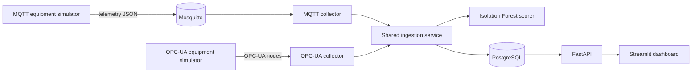

# Industrial IoT Monitoring and Predictive Analytics Platform

A portfolio-scale industrial IoT reference project that simulates rotating equipment, ingests telemetry over **MQTT** and **OPC-UA**, stores time-series data in **PostgreSQL**, scores readings with a **scikit-learn Isolation Forest**, exposes results through **FastAPI**, and visualizes system health in a **Streamlit dashboard**.

> This is an engineering demonstration using synthetic equipment data. It does not claim production deployment or validated failure prediction on real machinery.

## What the demo proves

- Two industrial protocol paths converge on one validated telemetry contract.
- Normal and injected-fault readings are persisted with equipment and event context.
- Anomaly scores are stored separately from raw observations and exposed by REST APIs.
- Health checks distinguish application liveness from database readiness.
- A single Docker Compose command starts the database, broker, simulators, collectors, API, and dashboard.
- Automated tests and GitHub Actions check API and anomaly-model behavior.

## Architecture



See [docs/architecture.md](docs/architecture.md) for component responsibilities and tradeoffs.

## Quick start with Docker

Prerequisites: Docker Desktop with Docker Compose v2.

```bash
docker compose up --build
```

The Compose file includes safe local defaults. Copy `.env.example` to `.env` only when you want to override them.

After startup:

- API documentation: <http://localhost:8000/docs>
- Dashboard: <http://localhost:8501>
- API readiness: <http://localhost:8000/health/ready>

The simulators deliberately inject intermittent bearing-wear and overheating conditions. Allow 30–60 seconds for trends and anomaly events to appear.

Stop the stack with:

```bash
docker compose down
```

Add `-v` only when you intentionally want to delete the local database volume.

## Local development

Python 3.12 is recommended; supported local versions are Python 3.11–3.13.

```bash
python -m venv .venv
source .venv/bin/activate
pip install -e '.[dev]'
cp .env.example .env
pytest
ruff check .
```

Run PostgreSQL and Mosquitto with Docker, then start individual components:

```bash
docker compose up -d postgres mosquitto
python -m iiot_platform.anomaly.train
uvicorn iiot_platform.main:app --reload
python -m iiot_platform.simulators.mqtt
python -m iiot_platform.collectors.mqtt
```

## API examples

```bash
curl http://localhost:8000/api/v1/equipment
curl 'http://localhost:8000/api/v1/equipment/pump-101/readings?limit=25'
curl 'http://localhost:8000/api/v1/anomalies?equipment_id=pump-101&limit=20'
```

Endpoint details are in [docs/api.md](docs/api.md).

## Repository map

```text
src/iiot_platform/
├── api/routes/       REST endpoints
├── anomaly/          training, artifact loading, and scoring
├── collectors/       MQTT and OPC-UA protocol adapters
├── dashboard/        Streamlit engineering dashboard
├── simulators/       normal operation and fault injection
├── config.py         environment-based configuration
├── db.py             asynchronous database lifecycle
├── models.py         relational data model
└── services.py       shared ingestion and query logic
```

## Roadmap

- [x] MQTT telemetry simulation and collection
- [x] OPC-UA server simulation and collection
- [x] PostgreSQL equipment, reading, anomaly, event, and maintenance schema
- [x] Isolation Forest training and runtime scoring
- [x] FastAPI equipment, history, anomaly, and health endpoints
- [x] Streamlit status and trend dashboard
- [x] Docker Compose local environment
- [x] Unit/API tests and GitHub Actions
- [ ] Alembic migration history for post-MVP schema changes
- [ ] Authenticated operator and administrator roles
- [ ] Model evaluation report with labeled holdout fault scenarios
- [ ] Prometheus metrics and OpenTelemetry traces

## Portfolio talking points

The strongest defensible story is the end-to-end contract: protocol-specific collection, one normalized schema, transactional persistence, reproducible anomaly scoring, query APIs, visualization, and automated verification. Be explicit that the equipment and faults are simulated and that anomaly detection is an early-warning demonstration—not a certified predictive-maintenance model.

## License

MIT — see [LICENSE](LICENSE).
