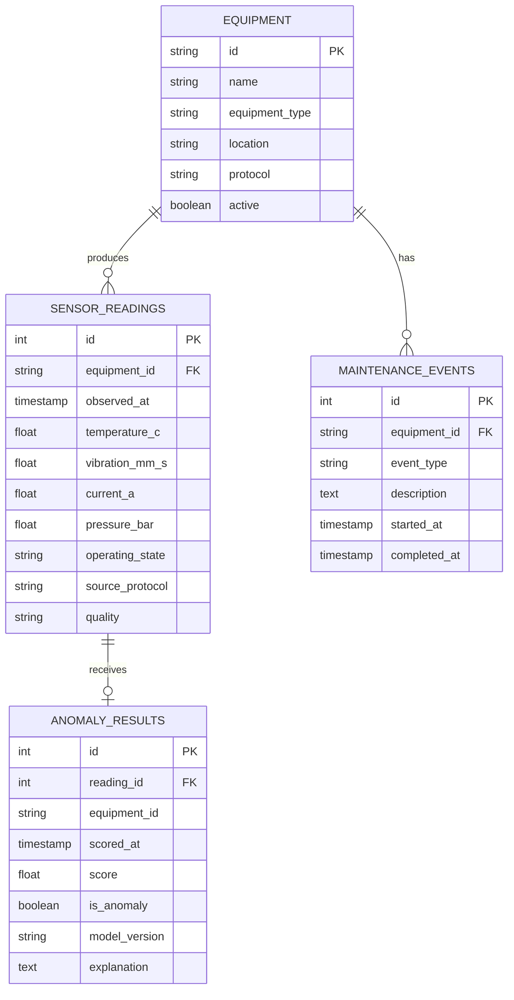

# Database Schema

## Entity relationships



`system_events` captures component events independently of equipment telemetry. The composite reading index on `(equipment_id, observed_at)` supports the dashboard's most common history query. Anomaly rows retain `equipment_id` in addition to the reading relationship to make event filtering explicit and efficient.

The MVP creates the initial schema at startup. Once the baseline stabilizes, add Alembic and require a migration for every schema change.

## Example reliability query

Daily anomalous-reading rate by equipment:

```sql
SELECT
    equipment_id,
    date_trunc('day', scored_at) AS day,
    count(*) FILTER (WHERE is_anomaly) AS anomaly_count,
    count(*) AS readings_scored,
    round(
        count(*) FILTER (WHERE is_anomaly)::numeric / nullif(count(*), 0),
        4
    ) AS anomaly_rate
FROM anomaly_results
GROUP BY equipment_id, date_trunc('day', scored_at)
ORDER BY day DESC, equipment_id;
```
